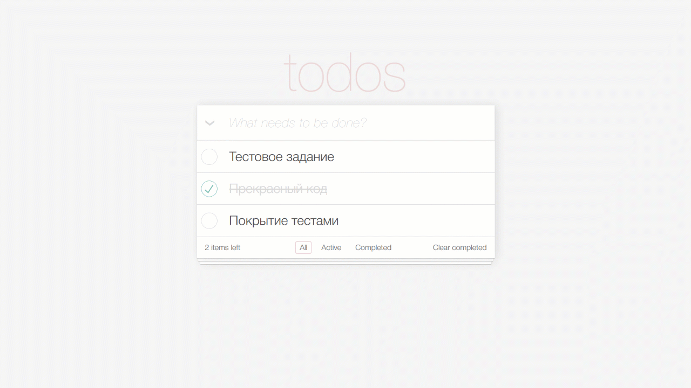

# "Todo App" Test Project



## Description

### A todo app that manages a list of tasks

### Features

- Pixel-perfect layout
- An input field for a new task
- List of all tasks with option to hide it
- Separate filters to show lists of `Completed` and `Active` tasks
- 100% Unit Tests coverage
- Utilized React Hooks

### Dependencies

1. `Vite`
2. `React` • `TypeScript`
3. `Vitest` • `React Testing Library`

## Installation & Execution

### Install via Vite

```bash
  git clone https://github.com/mirzaianov/test-todo.git
  cd test-todo
  npm i
```

### Run in the development mode

```bash
  npm run start
```

Vite will start frontend server on [http://localhost:5173/](http://localhost:5173/)

### Or open the deployed site

[https://todo-mirzaianov.vercel.app/](https://todo-mirzaianov.vercel.app/)

## License

### MIT license

You can use the code, but I ask you do not copy this site without giving me credit.
